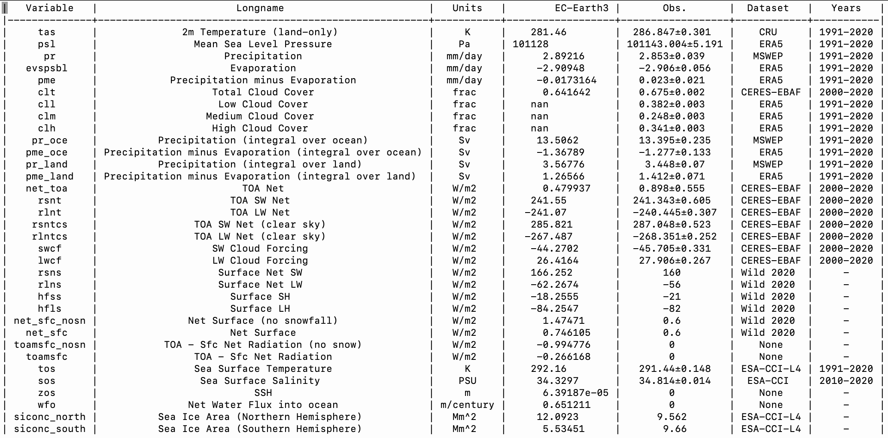

Global Mean
===========

Main concepts
^^^^^^^^^^^^^

The ``global_mean`` command is based on ``global_mean.py`` script which computes the global averages for many dynamical and physical fields
It compares the output against a set of pre-computed climatological values defined in ``reference/gm_reference.yml``, including the most important dynamical and physical fields for both the atmosphere and the ocean (e.g. temperature, salinity, etc.).

Most importantly, it provides estimate for the radiative budget (including clouds radiative forcing) and for the hydrological cycle (including integrals over land and ocean) 
and other quantities useful for fast model assessment and for model tuning.

Usage
^^^^^

Running the global mean evaluation is rather simple ::

        global_mean EXP Y1 Y2

Alternative, you also run the python script

        ./global_mean.py EXP Y1 Y2

- `Positional arguments`:

  EXP                   
    experiment identification

  Y1                    
    starting year of analysis

  Y2                   
    final year of analysis

- `Optional arguments`:

  -h, --help            	show this help message and exit
  -s, --silent          	do not print anything to std output
  -t, --trend           	compute trends on multiple years
  -l, --line            	appends also single line to a table
  -c CONFIG, --config CONFIG	set up a specific configuration file (config.yml is default)
  -i INTERFACE, --interface INTERFACE   set up a specific interface file (override config.yml)
  -o FILE, --output FILE        path of output one-line table
  -m MODEL, --model MODEL       model name (override config.yml)
  -v LOGLEVEL, --loglevel LOGLEVEL      define the level of logging. Default is warning.
  -j NUMPROC                    number of processors to use
  -e ENSEMBLE, --ensemble ENSEMBLE      variant label (ripf number for cmor)

Output
^^^^^^

A txt table including the comparison with some predefined dataset.

   An example for a single year of the EC-Earth3 historical r1i1p1f1 simulation.

Example
^^^^^^^

Usage example for CMIP5::

        ./global_mean.py historical 1990 1999 -j 12 -m EC-EARTH -e r1i1p1 -i CMIP5

will compute performance indices for member r1i1p1 of the EC-EARTH model in the CMIP5 historical experiment.
