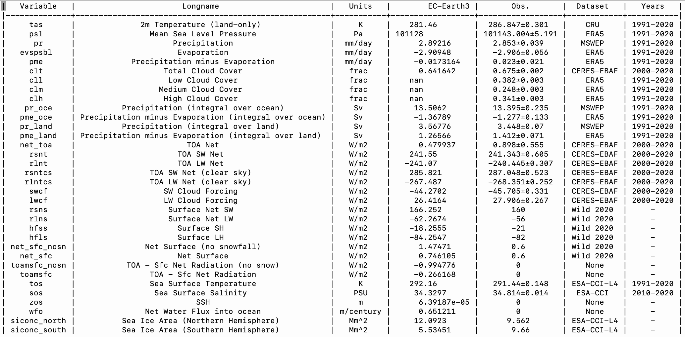

Global Mean
===========

Main concepts
^^^^^^^^^^^^^

The ``global_mean`` command is based on ``global_mean.py`` script which computes the global averages for many dynamical and physical fields
It compares the output against a set of pre-computed ``EC23`` or ``EC26-CMIP`` or ``EC26-HIST`` or ``EC26-PDAY`` climatological values defined in ``ecmean/reference/gm_reference_EC23.yml`` or ``ecmean/reference/gm_reference/gm_reference_EC26-CMIP.yml`` or ``ecmean/reference/gm_reference/gm_reference_EC26-HIST.yml``, or ``ecmean/reference/gm_reference/gm_reference_EC26-PDAY.yml`` 
including the most important dynamical and physical fields for both the atmosphere and the ocean (e.g. land temperature, salinity, etc.).
Different datasates are taken in consideration, providing an estimate of the interannual variability in the form of standard deviation.

Most importantly, it provides estimate for the radiative budget (including clouds radiative forcing) and for the hydrological cycle (including integrals over land and ocean) 
and other quantities useful for fast model assessment and for model tuning.

Usage
^^^^^

Running the global mean evaluation is rather simple ::

        global_mean EXP Y1 Y2

Alternative, you also run the python script in ``ecmean`` library ::

        ./global_mean.py EXP Y1 Y2

Positional Arguments
--------------------

  EXP                   
    experiment identification

  Y1                    
    starting year of analysis

  Y2                   
    final year of analysis

Optional Arguments
------------------

.. option:: -h, --help

   Show this help message and exit.

.. option:: -s, --silent

   Do not print anything to standard output.

.. option:: --trend

   Compute trends on multiple years. This option is only available in table format.

.. option:: --line

   Append a single line to the table.

.. option:: -c CONFIG, --config CONFIG

   Set up a specific configuration file. The default is ``config.yml``.

.. option:: -i INTERFACE, --interface INTERFACE

   Set up a specific interface file, overriding the configuration specified in ``config.yml``.

.. option:: -o DIR, --outputdir DIR

   Specify the path of the output directory. This will create a `YAML` and `PDF` folders for table and figures.

.. option:: -m MODEL, --model MODEL

   Specify the model name, overriding the configuration specified in ``config.yml``.

.. option:: --addnan

   Activate to plot also in the heatmap also fields which does not have a comparison against observations. Default is False.

.. option:: -l LOGLEVEL, --loglevel LOGLEVEL

   Define the level of logging. The default is 'warning'.

.. option:: -j NUMPROC

   Specify the number of processors to use.

.. option:: -e ENSEMBLE, --ensemble ENSEMBLE

   Specify the variant label (ripf number for cmor).

Example
^^^^^^^

Usage example for CMIP5::

        global_mean historical 1990 1999 -j 12 -m EC-EARTH -e r1i1p1 -i CMIP5

will compute global mean for member r1i1p1 of the EC-EARTH model in the CMIP5 historical experiment.

Output
^^^^^^

A txt table including the comparison with some predefined dataset, for the global mean yearly averages.

   An example for a single year of the EC-Earth3 historical r1i1p1f1 simulation.

In the same time, data are stored in more machine-readable format in a YAML file, which includes much more details as the global and regional mean over different seasons.
In addition, |ecmean| 4 produces also a figure including a more detailed comparison for different seasons and regions.
This is available only for the datasets for which we have access to a gridded dataset.

.. figure:: _static/globaltestfigure.png
   :align: center
   :width: 600px
   :alt: Global mean figure for EC-Earth3

   An example for a single year of the EC-Earth3 historical r1i1p1f1 simulation. Colors indicate the model bias as standard deviation of the interannual variability from observations.
   Blues implies negative bias, reds positive bias. In each of the tiles the larger number show the model value, while the smaller one is the reference value. 

Climatology computation
^^^^^^^^^^^^^^^^^^^^^^^

Climatology is computed by the ``ecmean/utils/reference-create.py`` script, which is included in the repository for documentation.
It is based on a YML file which is tells the script where to retrieve the data, identifying all the required data folder and names. 
The results are produced into a YML file for in ``ecmean/reference/gm_reference_EC**.yml`` which includes the global and regional mean 
over different seasons as well the interannual standard deviation. All details on the datasets are found there. 

References available 
^^^^^^^^^^^^^^^^^^^^

Currently, four different references for climatological values are available, covering different observation periods.

EC23
----
This is from the old version of |ecmean| and does not include values for global tas. 
This reference dataset collects global mean observational targets used by the global_mean.py script to compute global averages.
The variables are derived from a combination of observational and reanalysis products (e.g. CRU, ERA5, MSWEP, CERES-EBAF, ESA-CCI, Wild 2020), depending on the physical quantity considered. 
Most fields are defined over the 1991–2020 period, while other variables use shorter observational windows due to data availability.
All metadata (datasets, masks, periods and other properties) are defined in the corresponding YAML configuration file.

.. include:: tables/reference_EC23.rst

EC26
----
EC26 is an updated reference framework for global mean observational targets used in |ecmean| 4. 
It provides temporally consistent baselines tailored to different model forcing configurations. 
It also includes a global near-surface air temperature target, which was not available in the older reference.
The variables are derived from a combination of observational and reanalysis products (e.g. CRU v4.09, Berkeley Earth, ERA5, MSWEP v2.80, CERES EBAF v4.2.1, ESA-CCI, Wild 2020), depending on the physical quantity considered. 

EC26 is structured into three configurations, each designed to match a specific class of climate model simulations:

  - CMIP
  - HIST
  - PDAY

All configurations share the same variable definitions and masking strategy (global, land, ocean), but differ in their temporal averaging window to ensure consistency with the intended model experiments.

ECE26_CMIP
----------
This reference dataset is designed for the evaluation of CMIP6 historical simulations against a consistent observational baseline.
It is aligned with the CMIP6 historical period (1985–2014), ensuring temporal consistency between model climatologies and observational targets. 
Radiative fluxes are restricted to the satellite era (2000–2014), while ocean salinity follows its specific observational availability window.
All metadata (datasets, masks, periods and other properties) are defined in the corresponding YAML configuration file.

.. include:: tables/reference_EC26_CMIP.rst

ECE26_HIST
----------
This configuration is designed for comparison with model simulations using historical forcing or present-day forcing fixed around 1990.
The reference period spans 1981–2010 where observational coverage allows. Radiative fluxes follow the CERES satellite era (starting in 2000), while other variables use the 1981–2010 window.
All metadata (datasets, masks, periods and other properties) are defined in the corresponding YAML configuration file.

.. include:: tables/reference_EC26_HIST.rst

ECE26_PDAY
----------
This configuration is intended for evaluation of model simulations using present-day forcing conditions representative of the 2010–2012 period.
The reference period spans 2000–2024 (or the maximum available year depending on dataset availability; e.g. 2023 for ESA-CCI-L4 products).
By using a more recent averaging window, EC26-PDAY reflects contemporary radiative balance and hydrological cycle conditions, making it suitable for fixed present-day forcing experiments.
All metadata (datasets, masks, periods and other properties) are defined in the corresponding YAML configuration file.

.. include:: tables/reference_EC26_PDAY.rst
