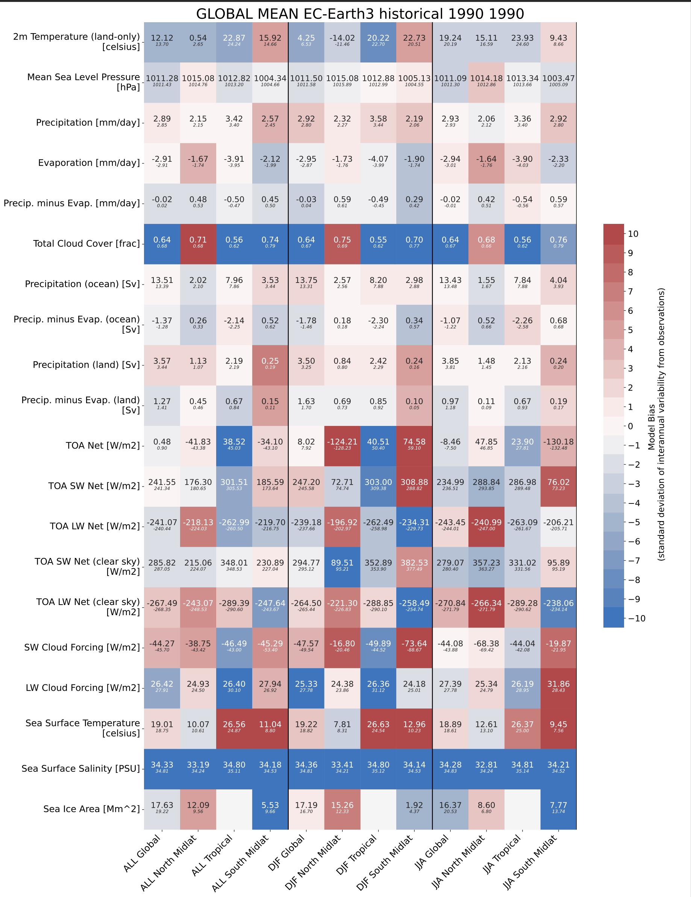

Global Mean
===========

Main concepts
^^^^^^^^^^^^^

The ``global_mean`` command is based on ``global_mean.py`` script which computes the global averages for many dynamical and physical fields
It compares the output against a set of pre-computed climatological values defined in ``ecmean/reference/gm_reference_EC23.yml``, including the most important dynamical and physical fields 
for both the atmosphere and the ocean (e.g. land temperature, salinity, etc.).
Different datasates are taken in consideration, providing an estimate of the interannual variability in the form of standard deviation.

Most importantly, it provides estimate for the radiative budget (including clouds radiative forcing) and for the hydrological cycle (including integrals over land and ocean) 
and other quantities useful for fast model assessment and for model tuning.

Usage
^^^^^

Running the global mean evaluation is rather simple ::

        global_mean EXP Y1 Y2

Alternative, you also run the python script in ``ecmean`` library ::

        ./global_mean.py EXP Y1 Y2

Positional Arguments
--------------------

  EXP                   
    experiment identification

  Y1                    
    starting year of analysis

  Y2                   
    final year of analysis

Optional Arguments
------------------

.. option:: -h, --help

   Show this help message and exit.

.. option:: -s, --silent

   Do not print anything to standard output.

.. option:: -t, --trend

   Compute trends on multiple years. This option is only available in table format.

.. option:: -l, --line

   Append a single line to the table.

.. option:: -c CONFIG, --config CONFIG

   Set up a specific configuration file. The default is ``config.yml``.

.. option:: -i INTERFACE, --interface INTERFACE

   Set up a specific interface file, overriding the configuration specified in ``config.yml``.

.. option:: -o DIR, --outputdir DIR

   Specify the path of the output directory. This will create a `YAML` and `PDF` folders for table and figures.

.. option:: -m MODEL, --model MODEL

   Specify the model name, overriding the configuration specified in ``config.yml``.

.. option:: -v LOGLEVEL, --loglevel LOGLEVEL

   Define the level of logging. The default is 'warning'.

.. option:: -j NUMPROC

   Specify the number of processors to use.

.. option:: -e ENSEMBLE, --ensemble ENSEMBLE

   Specify the variant label (ripf number for cmor).

Example
^^^^^^^

Usage example for CMIP5::

        global_mean historical 1990 1999 -j 12 -m EC-EARTH -e r1i1p1 -i CMIP5

will compute performance indices for member r1i1p1 of the EC-EARTH model in the CMIP5 historical experiment.

Output
^^^^^^

A txt table including the comparison with some predefined dataset, for the global mean yearly averages.

.. figure:: _static/globaltesttable.png
   :align: center
   :width: 600px
   :alt: Global mean table for EC-Earth3

   An example for a single year of the EC-Earth3 historical r1i1p1f1 simulation.

In addition, it produces also a figure including a more detailed comparison for different seasons and regions.
This is available only for the datasets for which we have access to a gridded dataset.

   An example for a single year of the EC-Earth3 historical r1i1p1f1 simulation. Colors indicate the model bias as standard deviation of the interannual variability from observations.
   Blues implies negative bias, reds positive bias. In each of the tiles the larger number show the model value, while the smaller one is the reference value. 

Climatology computation
^^^^^^^^^^^^^^^^^^^^^^^

Climatology is computed by the ``ecmean/utils/reference-create.py`` script, which is included in the repository for documentation.
It is based on a YML file which is tells the script where to retrieve the data, identifying all the required data folder and names. 
The results are produced into a YML file for in ``ecmean/reference/gm_reference_EC23.yml`` which includes the global and regional mean 
over different seasons as well the interannual standard deviation. All details on the datasets are found there. 
