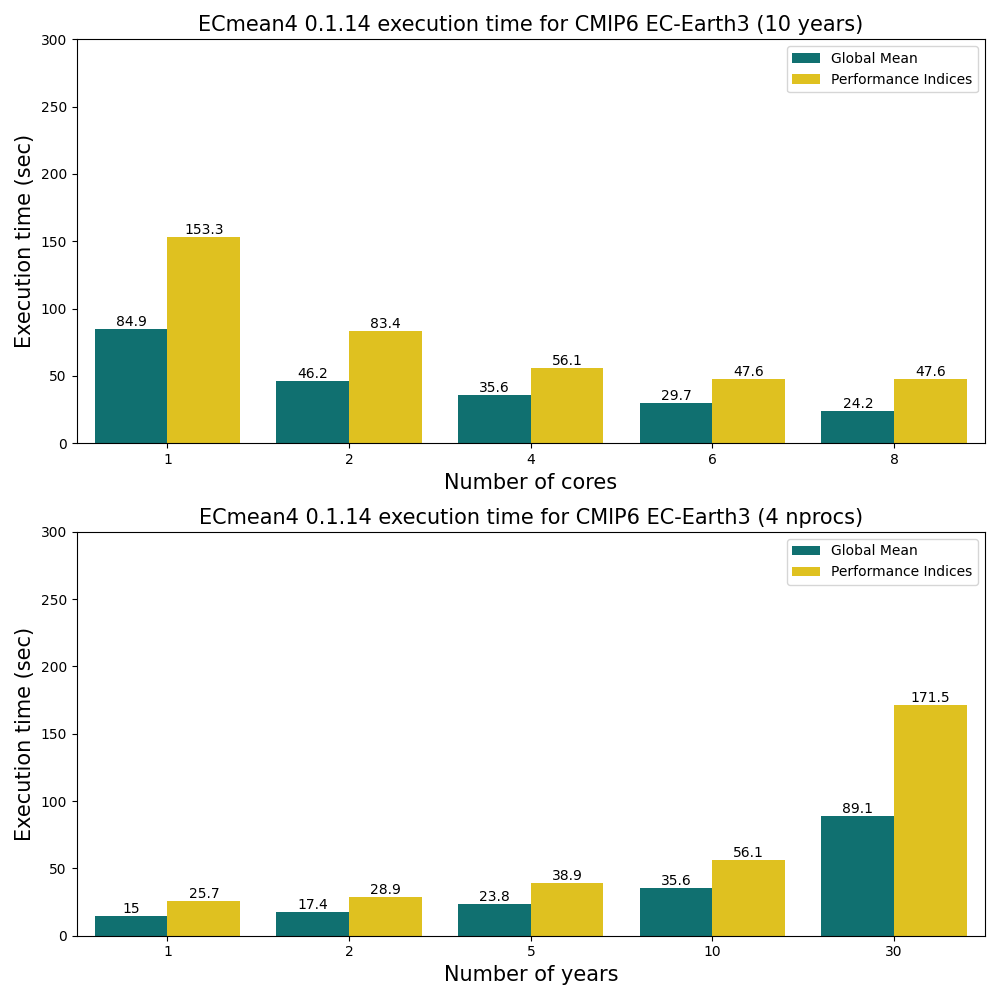

Introduction
============

About
-----

ECmean4 is a lightweight parallelized tool for evaluation of basic properties of Global Climate Models: to this date, it includes the evaluation of global mean quantities
and a series of climate model performance indices.
 
It builds on the original `ECmean <https://github.com/plesager/ece3-postproc/tree/master/ECmean>`_ which has been used for EC-Earth2 and EC-Earth3 evaluation, but it uses Python3 use YML configuration files. 
While the original ECmean4 version has been developed via CDO lazy calls, the current version is based on `Xarray <https://docs.xarray.dev/en/stable/>`_ + `Dask <https://examples.dask.org/xarray.html>`_.

Under the hood
--------------

ECmean4 is built on a Xarray + Dask lazy calls which are executed in a single instance at the end of the script, 
exploiting parallelization on multiple variables with `Multiprocessing <https://docs.python.org/3/library/multiprocessing.html>`_. 
This allows to have a fast data analysis without writing unnecessary files on disk. Interpolation is carried out with `xESMF <https://xesmf.readthedocs.io/en/latest/>`_. 
Area weighting is internally assessed based on spherical triangles computation (i.e. L'Huilier theorem), and it uses coordinates boundaries as far as possible.
Working with YML files in each configuration aspects allows for a more flexible usage, making possible expanding the support to new climate models or to include new reference climatologies. 
Scripts are thought to be run from command line so that they can be easily integrated within a Earth System Model workflow.

ECmean4 also takes into account possible unit mismatch between the original dataset and the observational datasets, making using of the `MetPY <https://unidata.github.io/MetPy/latest/index.html>`_ 
extension of the Pint python package. Heat and moisture flux sign convention is also assessed.

For the performance indices, since interpolation is required, weights are pre-computed only once to increase efficiency. 
Although conservative interpolation would be the better option, so far bilinear interpolation is preferred since it ensures more consistent results. 

	
Computational performances
--------------------------

ECmean4 can process many years and multiple variables in less than 5 minutes (assuming that output is provided from monthly means). 
Performance indices are implicitly slower than global mean, but with a few cores available both can be completed in a couple of minutes.
Since parallelization is done along variables, it does not make sense (especially for performance indices) to use more than 6 cores due to the limited number of variables. 

Scaling has been tested on a Xeon 16-Core 6130 2,1Ghz machine, analysing EC-Earth3 CMIP6 historical run (i.e. TL255L91, about 0.7x0.7 deg), using the fixed ``ecmean/utils/config_benchmark.yml`` (i.e. for performance indices evaluating on 3 seasons and 4 regions).

   A multi-core (upper panel) and multi-year (lower-panel) benchmarking for Global Mean and Performance Indices for CMIP6 EC-Earth3 historical data

.. note ::
	So far we cannot exploit completely Dask potentialities due to adoption of the multiprocessing library to work along variables. This issue will be addressed in future release, but so far dask scheduler is thus set to synchronous with ``dask.config.set(scheduler="synchronous")``.

.. warning ::
	Please do not use more cores than available variables: this might lead to code crash due to a limitation of multiprocessing. See the corresponding `GitHub issue <https://github.com/oloapinivad/ECmean4/issues/54>`_ .

How to cite
------------

ECmean4 is distributed via GitHub and pypi and released under the Apache License, version 2.0. Citation of the software DOI is kindly requested upon use:

- P. Davini, & J. von Hardenberg. (2024). ECmean4: a lightweight climate model evaluation tool. Zenodo. https://doi.org/10.5281/zenodo.13834628

Or alternatively, in bibtex format:

.. code-block:: bibtex

   @software{ecmean4,
      author       = {Paolo Davini, Jost von Hardenberg},
      title        = {ECmean4: : a lightweight climate model evaluation tool},
      year         = {2024},
      version      = {0.1.10},
      doi          = {10.5281/zenodo.13834628},
      url          = {https://github.com/ecmean4/ecmean4},
      howpublished = {\url{https://doi.org/10.5281/zenodo.13834628}},
      note         = {Open-source software}
   }

