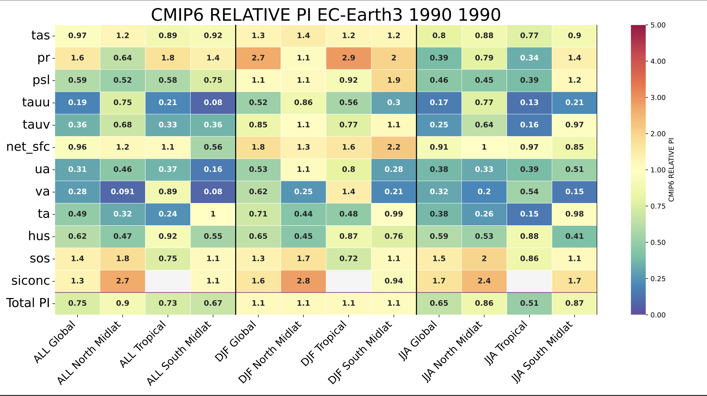

Performance Indices
===================

Main concepts
^^^^^^^^^^^^^

The ``performance_indices`` command is based on the ``performance_indices.py`` script which computes the `Reichler and Kim Performance Indices <https://journals.ametsoc.org/view/journals/bams/89/3/bams-89-3-303.xml>`_, usually known as PIs. 
Some minor differences from the original definition has been introduced, so that the PIs are computed on a common grid (user defined, 1deg by default) rather than on the original observational grid.

From the original definition a few improvements has been introduced, producing the PIs also for a set of selected regions and seasons. 

PIs are computed as the root mean square error of a 2D field normalized by the interannual variance estimated from the observations, as follows:

.. math::

   \text{PI} = \frac{\sum \left( \text{Model climatology} - \text{Observation climatology} \right)^2}{\text{Observation variance}}

Larger values implies worse performance of the climate models.
For sake of simplicity, they can be normalized by the CMIP6 ensemble average, 
so that values smaller than one implies a better results than CMIP6 ensemble average.

.. note :: 

   3D fields (e.g. zonal wind, temperature, etc.) are treated as 2D fields by performing the zonal average. 
   All vertical levels are considered, and if mismatch is found between the model and the observations, the model data are linearly interpolated to the observation grid.

Usage
^^^^^

Running the performance indices evaluation is rather simple ::

        performance_indices EXP Y1 Y2

You can also run it from the specific python script in ``ecmean`` library ::

        ./performance_indices.py EXP Y1 Y2

Positional Arguments
--------------------

* ``EXP``
  Experiment identification.

* ``Y1``
  Starting year of analysis.

* ``Y2``
  Final year of analysis.

Optional Arguments
------------------

.. option:: -h, --help

    Show this help message and exit.

.. option:: -s, --silent

    Do not print anything to std output.

.. option:: -v LOGLEVEL, --loglevel LOGLEVEL

    Define the level of logging. Default: error.

.. option:: -j NUMPROC

    Specify the number of processors to use.

.. option:: -c CONFIG, --config CONFIG

    Set up a specific configuration file (config.yml is default).

.. option:: -i INTERFACE, --interface INTERFACE

    Set up a specific interface file (override config.yml).

.. option:: -m MODEL, --model MODEL

    Specify the model name.

.. option:: -e ENSEMBLE, --ensemble ENSEMBLE

    Specify the variant label (i.e., ripf number for cmor).

.. option:: -d, --debug

    Activate CDO debugging.

.. option:: -k CLIMATOLOGY

    Specify the climatology you want to use (EC23: default).

.. option:: -r RESOLUTION

    Only EC23: Specify the resolution of the climatology (r180x90 or r360x180).

.. option:: -o DIR, --outputdir DIR

   Specify the path of the output directory. This will create a `YAML` and `PDF` folders for table and figures.

Example 
^^^^^^^

Usage example for CMIP6 (running on 12 cores for EC-Earth3 historical)::

  > .performance_indices historical 1990 1999 -j 12 -m EC-Earth3 -e r1i1p1f1 -i CMIP6 

Usage example for EC-Earth4 (running on 4 cores for EC-Earth4 experment ABC1)::

  > performance_indices ABC1 1990 1999 -j 4

Output
^^^^^^

The result is produced in a form a YAML file, indicating PIs for each variable, region and season, that is stored for later evaluation. 
Most importantly, a figure is produced showing a "score card" for the different regions, variables and seasons.

For the sake of simplicity, the PIs figure is shown as the ratio between the model PI and the average value estimated over the (precomputed) ensemble of CMIP6 models. 
An example of the the output for a single year of the EC-Earth3 historical simulation is shown here below.

   An example for a single year of the EC-Earth3 historical r1i1p1f1 simulation. Values smaller than one implies a better results than CMIP6 ensemble average.

Climatologies available
^^^^^^^^^^^^^^^^^^^^^^^

Currently, three different climatologies are available:

EC23
----
This is built with high-resolution data (e.g. CRU, ERA5, MSWEP, etc.) and defined on a 1x1 deg resolution for year 1990-2019. It uses a 30-year time window for CMIP6 models.

Properties of the climatology - as which interpolation method and which CMIP6 models has been used - can be inspected looking at ``ecmean/climatology/EC24/pi_climatology_ECE24.yml`` file.

.. list-table:: Data used in EC23 climatology
   :header-rows: 1
   :widths: 30 30 30

   * - **Variable**
     - **Observations**
     - **Models**
   * - 2m temperature (land-only)
     - CRU TS 4.05, 1990-2019
     - 11 CMIP6 models over 1981-2010
   * - Precipitation
     - MSWEP, 1990-2019
     - 12 CMIP6 models over 1981-2010
   * - Net surface radiation
     - NOCS, 1990-2014
     - 8 CMIP6 models over 1981-2010
   * - Eastward wind stress
     - ORAS5, 1990-2019
     - 10 CMIP6 models over 1981-2010
   * - Meridional wind stress
     - ORAS5, 1990-2019
     - 10 CMIP6 models over 1981-2010
   * - Mean sea level pressure
     - ERA5, 1990-2019
     - 11 CMIP6 models over 1981-2010
   * - Zonal wind
     - ERA5, 1990-2019
     - 11 CMIP6 models over 1981-2010
   * - Meridional wind
     - ERA5, 1990-2019
     - 11 CMIP6 models over 1981-2010
   * - Air temperature
     - ERA5, 1990-2019
     - 11 CMIP6 models over 1981-2010
   * - Specific humidity
     - ERA5, 1990-2019
     - 10 CMIP6 models over 1981-2010
   * - Sea surface temperature
     - ESA-CCI-L4
     - 12 CMIP6 models over 1981-2010
   * - Sea surface salinity
     - ORAS5, 1990-2019
     - 8 CMIP6 models over 1981-2010
   * - Sea ice concentration
     - ESA-CCI-L4
     - 6 CMIP6 models over 1981-2010

EC24
----

This is an upgrade of EC23, with the following improvements:
  - It is scaled to 1985-2014, to be consistent with the CMIP6 historical simulations.
  - It removes data above 10hPa for 3D fields, to avoid unrealistic large PIs due to stratospheric low variances.
  - It extend the amount of regions to be considered, allowing also for Northern/Southern Hemisphere, Equatorial and South/North Pole regions.
  - It includes more climate models, that now ranges between 10 to 15 according to the variable.

Properties of the climatology - as which interpolation method and which CMIP6 models has been used - can be inspected looking at ``ecmean/climatology/EC24/pi_climatology_ECE24.yml`` file.

.. list-table:: Data used in EC24 climatology
   :header-rows: 1
   :widths: 30 30 30

   * - **Variable**
     - **Observations**
     - **Models**
   * - 2m temperature (land-only)
     - CRU TS 4.05, 1985-2014
     - 12 CMIP6 models over 1985-2014
   * - Precipitation
     - MSWEP, 1985-2014
     - 12 CMIP6 models over 1985-2014
   * - Net surface radiation
     - NOCS, 1985-2014
     - 10 CMIP6 models over 1985-2014
   * - Eastward wind stress
     - ORAS5, 1985-2014
     - 14 CMIP6 models over 1985-2014
   * - Meridional wind stress
     - ORAS5, 1985-2014
     - 12 CMIP6 models over 1985-2014
   * - Mean sea level pressure
     - ERA5, 1985-2014
     - 12 CMIP6 models over 1985-2014
   * - Zonal wind
     - ERA5, 1985-2014
     - 12 CMIP6 models over 1985-2014
   * - Meridional wind
     - ERA5, 1985-2014
     - 13 CMIP6 models over 1985-2014
   * - Air temperature
     - ERA5, 1985-2014
     - 15 CMIP6 models over 1985-2014
   * - Specific humidity
     - ERA5, 1985-2014
     - 13 CMIP6 models over 1985-2014
   * - Sea surface temperature
     - ESA-CCI-L4
     - 14 CMIP6 models over 1985-2014
   * - Sea surface salinity
     - ORAS5, 1985-2014
     - 14 CMIP6 models over 1985-2014
   * - Sea ice concentration
     - ESA-CCI-L4
     - 11 CMIP6 models over 1985-2014

Climatology computaton
^^^^^^^^^^^^^^^^^^^^^^

Climatology is computed by the ``ecmean/utils/clim-create.py`` script, which is included in the repository for documentation.
It is based on a YML file which is tells the script where to retrieve the data, identifying all the required data folder, names and description. 
The tool loops over the variable and produces the yearly and seasonal average of the climate, as well as the interannual variance required for PIs. 

.. note ::
  PIs strongly depends on the interannual variance of the reference datasates. Some datasets have extremely low values which leads to unrealistic large PIs. 
  To avoid that grid points with unrealistic low variance affect the computation of the PIs, a filter to exclude outlier is introduced. This is based on the 5-sigma of the log10 distribution of each variable and each season. 
  If the variance of a grid point is above or below the 5-sigma, the grid point is excluded from the computation of the PIs.
  However, some fields as specific humidity (`hus`) are still characterized by very large PIs (due to stratospheric low variances).

.. Current climatology has been developed making use of high-resolution data (e.g. CRU, ERA5, MSWEP, etc.) and is defined as ``EC23``, using a 1x1 deg resolution and being the default. 
.. Properties of each climatology - as which interpolation method and which CMIP6 models has been used - can be inspected looking at ``ecmean/climatology/{clim}/pi_climatology_ECE23.yml`` files.

CMIP6 comparison
^^^^^^^^^^^^^^^^

Once the climatology is created, the script ``ecmean/utils/cmip6-clim-evaluate.py`` is used to run iteratively on a set of CMIP6 models and to compute the multi model mean of the PIs (for each region and season).
A single ensemble member is used for each CMIP6 model, which is regridded toward the climatology grid. For CMIP6 models, a 30-year time window is used.
This is then stored in the ``ecmean/climatology/{clim}/pi_climatology_{clim}.yml`` and then used to provide a ratio between the original PI and the CMIP6 ensemble. 

