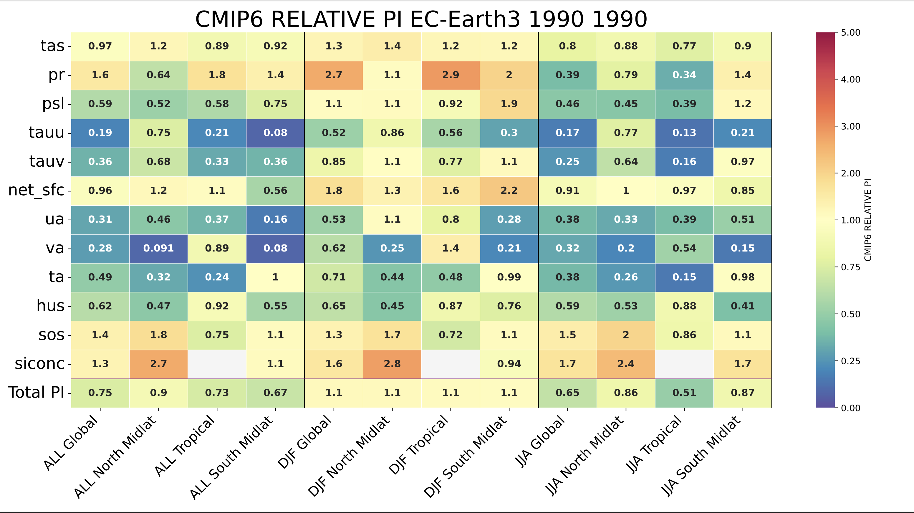

Performance Indices
===================

Main concepts
^^^^^^^^^^^^^

The ``performance_indices`` command is based on the ``performance_indices.py`` script which computes the `Reichler and Kim Performance Indices <https://journals.ametsoc.org/view/journals/bams/89/3/bams-89-3-303.xml>`_, usually known as PIs.
Some minor differences from the original definition have been introduced, so that the PIs are computed on a common grid (user defined, 1deg by default) rather than on the original observational grid.

From the original definition a few improvements have been introduced, producing the PIs also for a set of selected regions and seasons.

PIs are computed as the root mean square error of a 2D field normalized by the interannual variance estimated from the observations, as follows:

.. math::

   \text{PI} = \frac{\sum \left( \text{Model climatology} - \text{Observation climatology} \right)^2}{\text{Observation variance}}

Larger values imply worse performance of the climate models.
For sake of simplicity, they can be normalized by the CMIP6 ensemble average,
so that values smaller than one imply better results than CMIP6 ensemble average.

.. note::

   3D fields (e.g. zonal wind, temperature, etc.) are treated as 2D fields by performing the zonal average.
   All vertical levels are considered, and if a mismatch is found between the model and the observations, the model data are linearly interpolated to the observation grid.

Usage
^^^^^

Running the performance indices evaluation is rather simple::

   performance_indices EXP Y1 Y2

You can also run it from the specific python script in ``ecmean`` library::

   ./performance_indices.py EXP Y1 Y2

Positional Arguments
--------------------

  EXP
    Experiment identification.

  Y1
    Starting year of analysis.

  Y2
    Final year of analysis.

Optional Arguments
------------------

.. option:: -h, --help

   Show this help message and exit.

.. option:: -s, --silent

   Do not print anything to standard output.

.. option:: --version

   Show |ecmean|'s version number and exit.

.. option:: -l LOGLEVEL, --loglevel LOGLEVEL

   Define the level of logging. The default is 'warning'.

.. option:: -j NUMPROC

   Specify the number of processors to use.

.. option:: -c CONFIG, --config CONFIG

   Set up a specific configuration file. The default is ``config.yml``.

.. option:: -i INTERFACE, --interface INTERFACE

   Set up a specific interface file, overriding the configuration specified in ``config.yml``.

.. option:: -m MODEL, --model MODEL

   Specify the model name.

.. option:: -e ENSEMBLE, --ensemble ENSEMBLE

   Specify the variant label (i.e., ripf number for cmor).

.. option:: -o DIR, --outputdir DIR

   Specify the path of the output directory. This will create YAML and PDF folders for tables and figures.

.. option:: --climatology CLIMATOLOGY

   Specify the climatology you want to use. The default is EC24. Alternatives are EC26-HIST, EC26-CMIP and EC23.

Examples
^^^^^^^^

Usage example for CMIP6 (running on 12 cores for EC-Earth3 historical)::

   performance_indices historical 1990 1999 -j 12 -m EC-Earth3 -e r1i1p1f1 -i CMIP6

Usage example for EC-Earth4 (running on 4 cores for EC-Earth4 experiment ABC1)::

   performance_indices ABC1 1990 1999 -j 4

Output
^^^^^^

The result is produced in the form of a YAML file, indicating PIs for each variable, region and season, that is stored for later evaluation.
Most importantly, a figure is produced showing a "score card" for the different regions, variables and seasons.

For the sake of simplicity, the PIs figure is shown as the ratio between the model PI and the average value estimated over the (precomputed) ensemble of CMIP6 models.
An example of the output for a single year of the EC-Earth3 historical simulation is shown here below.

   An example for a single year of the EC-Earth3 historical r1i1p1f1 simulation. Values smaller than one imply better results than CMIP6 ensemble average.

Climatologies available
^^^^^^^^^^^^^^^^^^^^^^^

Currently, three different climatologies are available, EC26, EC24 and EC23, covering different observation periods and based on different datasets.

EC26
----

This is the updated climatology which further extends EC24 with updated datasets and a more recent reference period when available.

EC26-HIST (1981–2010)
~~~~~~~~~~~~~~~~~~~~~

This configuration is designed for comparison with model simulations using historical forcing or present-day forcing fixed around 1990.

.. include:: tables/climatology_EC26-HIST.rst

Properties of the climatology - such as which interpolation method and which CMIP6 models have been used - can be inspected by looking at the ``ecmean/climatology/EC26/pi_climatology_EC26-HIST.yml`` file.

EC26-CMIP (1985–2014)
~~~~~~~~~~~~~~~~~~~~~

This reference dataset is designed for the evaluation of CMIP6 historical simulations against a consistent observational baseline.
It is aligned with the CMIP6 historical period (1985–2014), ensuring temporal consistency between model climatologies and observational targets.

.. include:: tables/climatology_EC26-CMIP.rst

Properties of the climatology - such as which interpolation method and which CMIP6 models have been used - can be inspected by looking at the ``ecmean/climatology/EC26/pi_climatology_EC26-CMIP.yml`` file.

EC24
----

This is an upgrade of EC23 - and currently the default - with the following improvements:
  - It is scaled to 1985-2014, to be consistent with the CMIP6 historical simulations.
  - It removes data above 10hPa for 3D fields, to avoid unrealistic large PIs due to stratospheric low variances.
  - It extend the amount of regions to be considered, allowing also for Northern/Southern Hemisphere, Equatorial and South/North Pole regions.
  - It includes more climate models, that now ranges between 10 to 15 according to the variable.

Properties of the climatology - such as which interpolation method and which CMIP6 models have been used - can be inspected by looking at the ``ecmean/climatology/EC24/pi_climatology_EC24.yml`` file.

.. include:: tables/climatology_EC24.rst

EC23
----
This is built with high-resolution data (e.g. CRU, ERA5, MSWEP, etc.) and defined on a 1x1 deg resolution for year 1990-2019. It uses a 30-year time window for CMIP6 models.

Properties of the climatology - such as which interpolation method and which CMIP6 models have been used - can be inspected by looking at the ``ecmean/climatology/EC23/pi_climatology_EC23.yml`` file.

.. list-table:: Data used in EC23 climatology
   :header-rows: 1
   :widths: 30 30 30

   * - **Variable**
     - **Observations**
     - **Models**
   * - 2m temperature (land-only)
     - CRU TS 4.05, 1990-2019
     - 11 CMIP6 models over 1981-2010
   * - Precipitation
     - MSWEP, 1990-2019
     - 12 CMIP6 models over 1981-2010
   * - Net surface radiation
     - NOCS, 1990-2014
     - 8 CMIP6 models over 1981-2010
   * - Eastward wind stress
     - ORAS5, 1990-2019
     - 10 CMIP6 models over 1981-2010
   * - Meridional wind stress
     - ORAS5, 1990-2019
     - 10 CMIP6 models over 1981-2010
   * - Mean sea level pressure
     - ERA5, 1990-2019
     - 11 CMIP6 models over 1981-2010
   * - Zonal wind
     - ERA5, 1990-2019
     - 11 CMIP6 models over 1981-2010
   * - Meridional wind
     - ERA5, 1990-2019
     - 11 CMIP6 models over 1981-2010
   * - Air temperature
     - ERA5, 1990-2019
     - 11 CMIP6 models over 1981-2010
   * - Specific humidity
     - ERA5, 1990-2019
     - 10 CMIP6 models over 1981-2010
   * - Sea surface temperature
     - ESA-CCI-L4
     - 12 CMIP6 models over 1981-2010
   * - Sea surface salinity
     - ORAS5, 1990-2019
     - 8 CMIP6 models over 1981-2010
   * - Sea ice concentration
     - ESA-CCI-L4
     - 6 CMIP6 models over 1981-2010

Climatology computation
^^^^^^^^^^^^^^^^^^^^^^^

Climatology is computed by the ``ecmean/utils/clim-create.py`` script, which is included in the repository for documentation.
It is based on a YML file which is tells the script where to retrieve the data, identifying all the required data folder, names and description.
The tool loops over the variable and produces the yearly and seasonal average of the climate, as well as the interannual variance required for PIs.
In the remote case you would like to develop a new climatology, you can create your own YML file and run the script to produce the reference climatology.
An example YML as `create-clim-wilma-EC26.yml` is provided in the repository.

Variance normalization
^^^^^^^^^^^^^^^^^^^^^^^

PIs strongly depend on the interannual variance of the reference datasets. Some datasets have extremely low values which lead to unrealistically large PIs.
To avoid that grid points with unrealistic low variance affect the computation of the PIs, a filter to exclude outlier is introduced.

For EC26 climatology, the filter is based on a combination of two constraints. The minimum accepted variance is defined by the maximum value between
- The 3-sigma from the mean the log10 distribution
- The 0.1% of the median variance of the log10 distribution.
If a grid point is below the minimum accepted variance, a clipping strategy is applied and the variance is set to the minimum accepted variance.

For EC24 and EC23 climatology, the filter is based on a single constraint, which is the 5-sigma from the mean of the log10 distribution.
This is based on the 5-sigma of the log10 distribution of each variable and each season.
If the variance of a grid point is above or below the 5-sigma, the grid point is excluded from the computation of the PIs.

CMIP6 comparison
^^^^^^^^^^^^^^^^

Once the climatology is created, the script ``ecmean/utils/cmip6-clim-evaluate.py`` is used to run iteratively on a set
of CMIP6 models and to compute the multi model mean of the PIs (for each region and season).
A single ensemble member is used for each CMIP6 model, which is regridded toward the climatology grid.
For CMIP6 models, a 30-year time window is used.
This is then stored in the ``ecmean/climatology/{clim}/pi_climatology_{clim}.yml`` and then used to provide a ratio between the original PI and the CMIP6 ensemble.

Following the same script, it would be possible to create a new comparison set to be used to scale the results of the PI, but at this stage
this is not yet possible.
